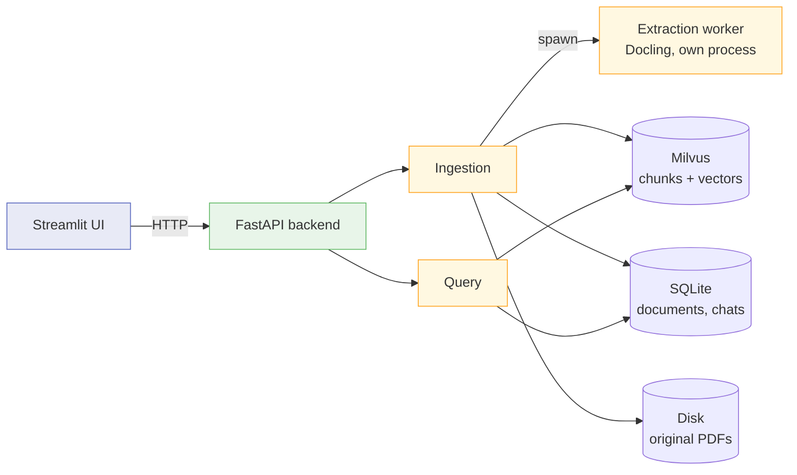
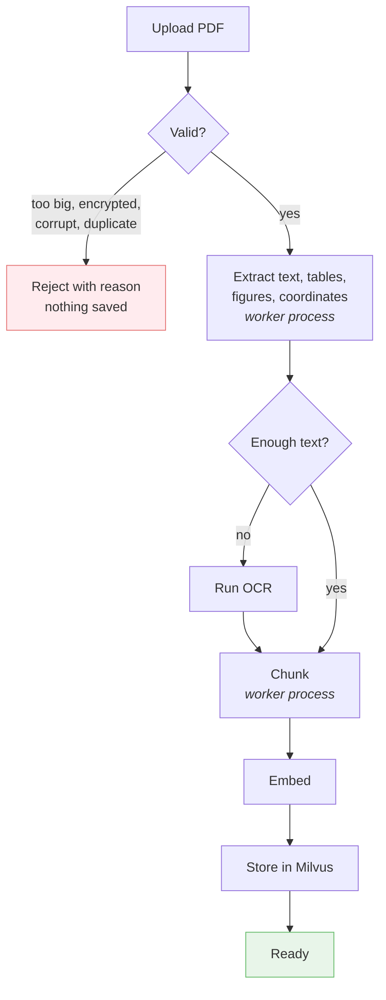
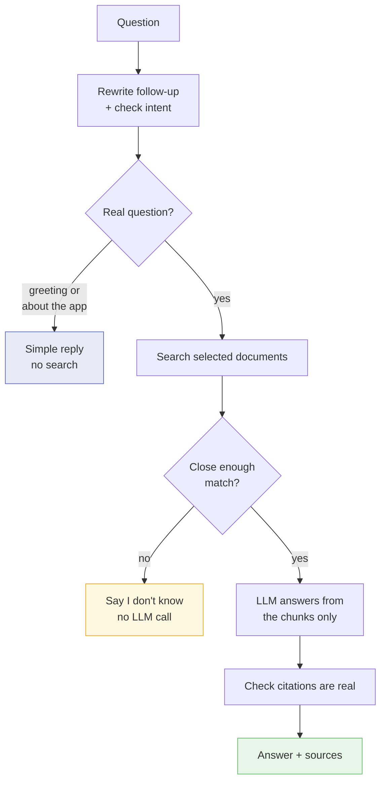

# Lens

**Ask questions about your documents. Get answers that show their source.**

Upload PDFs, ask questions in plain English, and get answers with a clickable citation pointing to the exact page. When the answer isn't in the documents, Lens says so instead of guessing.

---

## Contents

1. [What Lens does](#1-what-lens-does)
2. [The one rule everything follows](#2-the-one-rule-everything-follows)
3. [Scope](#3-scope)
4. [Architecture](#4-architecture)
5. [Tech stack](#5-tech-stack)
6. [How the app works](#6-how-the-app-works)
7. [Data model](#7-data-model)
8. [Ingestion pipeline](#8-ingestion-pipeline)
9. [Query pipeline](#9-query-pipeline)
10. [Citations and the confidence gate](#10-citations-and-the-confidence-gate)
11. [Conversations and context](#11-conversations-and-context)
12. [API](#12-api)
13. [Folder structure](#13-folder-structure)
14. [Configuration](#14-configuration)
15. [Error handling](#15-error-handling)
16. [Testing](#16-testing)
17. [Evaluation](#17-evaluation)
18. [Security](#18-security)
19. [Logging](#19-logging)
20. [Known limitations](#20-known-limitations)
21. [Future scope](#21-future-scope)
22. [Design decisions](#22-design-decisions)
23. [Build order](#23-build-order)
24. [Glossary](#24-glossary)

---

## 1. What Lens does

### The problem

Companies keep their rules in PDFs. HR policies, onboarding guides, SOPs, financial reports, system manuals, requirement documents. When someone needs an answer, they have to guess which document has it, then search inside a 40-page file.

Keyword search doesn't help much. Someone asking *"how much notice do I need before taking leave?"* won't match a document that says *"planned absences require prior authorisation."* The words are different even though the meaning is the same.

So people give up and ask HR or IT instead. The same question gets answered by a person over and over.

### Why just using an LLM makes it worse

If you hand documents to a language model and ask it questions, it will answer even when the answer isn't there. The answer will sound right — formal tone, confident wording, plausible structure. Someone will act on it.

**A wrong answer that looks right is worse than no answer**, because the person stops doubting and stops checking.

That's the real problem to solve. Answering questions from documents is easy. Answering *only* when the answer is actually there, and proving where it came from, is the hard part.

### What Lens is

A chat interface over a permanent document library.

- Upload a PDF once, it stays available forever
- Ask questions across all documents or just a few
- Every answer shows which document and page it came from, and clicking it opens that page with the text highlighted
- When nothing relevant is found, Lens says so
- Conversations are saved and can be reopened later

### Who uses it

| Person | Question |
|---|---|
| New employee | What do I need to do in my first week? |
| Any employee | How much notice for leave? Can I use my laptop personally? |
| Manager | What's the approval limit for this expense? |
| Analyst | What were operating revenues last year? |

### Why "Lens"

You look at your documents through it. Nothing more clever than that.

---

## 2. The one rule everything follows

> **The LLM handles language. Code handles every decision that has to be right.**

An LLM is good at understanding a question, reading a passage, and writing a clear answer. It is not reliable at knowing when to stop. So Lens never asks it to.

This shows up in three places:

**1. Refusing is a Python `if`, not a request.** A similarity threshold decides whether there's enough evidence, and it runs *before* the LLM is called. If retrieval finds nothing close enough, no LLM call happens at all.

The alternative is telling the LLM "say you don't know if you're unsure." That leaves refusing up to the model's mood. Faced with a passage that looks vaguely relevant, it will sometimes answer anyway. A threshold doesn't have moods.

**2. Citations can't be faked.** The LLM sees numbered chunks and cites by number — `[1]`, `[2]`. It never writes a document name or page number. Code checks each number was actually supplied, throws away anything that wasn't, and looks up the real document and page itself.

So a fake citation isn't unlikely. It's impossible, because the LLM has no way to produce one.

**3. No document-specific logic anywhere.** Heading detection, table handling, and chunking must work on any PDF. No filenames, titles, or page offsets in the code. If heading detection finds nothing, citations fall back to page numbers and everything keeps working.

The test: **Lens must work correctly on a PDF nobody has seen before, with no code changes.**

---

## 3. Scope

### In scope for v1

**Documents**
- PDF ingestion with layout-aware extraction
- Table extraction, kept as structured text
- OCR, but only for pages that have no text layer
- Figure detection with captions indexed
- Headers and footers removed
- Multi-column reading order handled
- Page number and coordinates recorded for every chunk

**Answering**
- Semantic search over a persistent vector store
- Confidence gate with a threshold measured from real data
- Answers grounded in retrieved chunks only
- Citations validated in code
- Clickable citations that open the page with the passage highlighted

**Chat**
- Multi-turn conversation with follow-up questions handled
- Conversations saved across restarts
- Per-conversation document selection, editable any time
- Auto-generated conversation titles
- Greetings and questions about the app handled without searching

**Library**
- One shared permanent library; every upload joins it
- Soft delete that doesn't break old conversations
- Duplicate detection by file hash
- Per-stage upload progress and clear failure messages

**Engineering**
- Separate backend and UI
- pytest suite over all the deterministic parts
- Evaluation script measuring retrieval and abstention
- Per-query logs

### Out of scope for v1

Each one is a decision with a reason, so it's clear these are choices and not gaps.

| Not building | Why |
|---|---|
| Login and user accounts | Single shared library is the agreed model. Adding users would change every data path for no v1 benefit |
| Per-document permissions | Needs user accounts first. A field is reserved in the schema so it can be added later without migration |
| Non-English documents | Needs multilingual embeddings and separate testing. Against an English index the behaviour is honest refusal, which is fine |
| Reading content inside images | Clickable citations let the user open the page and look at the figure themselves. Most of the value, none of the work |
| Hard table cases | Tables split across pages, merged cells, repeating headers. Basic tables are in; these aren't |
| Keyword + semantic hybrid search | A real weakness for things like form numbers. Deferred so semantic search can be measured on its own first |
| Reranking | Helps at much larger corpus sizes. Pointless here |
| Reindexing documents | Failed uploads are discarded rather than kept, so there's nothing to reindex |
| Export conversations | No workflow needs it |
| Folders for documents | Per-conversation selection already covers grouping |
| Rename documents, cancel upload, search the drawer | Convenience features that don't affect answer quality |
| Mobile layout | Desktop is enough |
| Job queue infrastructure | Background tasks in-process are fine at this scale |

### What the test documents need to be

These are requirements on *test material*, not on the pipeline. The pipeline must not be tuned to them.

| Property | Requirement |
|---|---|
| Count | 5 or more |
| Size | 5–50 pages, under 25 MB each |
| Format | PDF with a real text layer |
| Language | English |
| Variety | Different shapes — policy prose, step-by-step procedures, financial tables, system instructions, structured requirements |
| Tables | At least one document with real tables |
| Figures | At least one with captioned figures or screenshots |
| Overlap | At least two covering related topics, so citation targeting gets tested |

Two extra PDFs are kept **outside** the library as stress tests: one scanned with no text layer, one with two columns. These check that the pipeline degrades gracefully. They sit in `samples/` under a `stress_` prefix and are never indexed — they are run through `scripts/profile_pdf.py` and the result is reported.

---

## 4. Architecture



Extraction sits in a process of its own, not for tidiness but because Docling and Milvus Lite cannot coexist in one — see [Why extraction runs in its own process](#why-extraction-runs-in-its-own-process).

### Why a separate backend instead of one Streamlit app

**Ingestion would freeze the whole UI.** Streamlit runs one script per session in one thread. A 50-page PDF with OCR takes minutes, and during that time nothing works — you can't read old answers or query documents that are already indexed. With a backend, upload returns a job ID immediately, ingestion runs in the background, and the UI polls for progress. The rule "you can't use this document until it's indexed" then applies to *that document only*, which is what the spec actually wants.

**The pipeline becomes reusable.** Logic inside UI callbacks can only ever be used by that UI.

**Things become testable.** A backend with an HTTP contract can be tested without starting Streamlit.

**FastAPI and LangChain are also part of the required stack**, so this isn't extra work invented for its own sake.

### Three stores, three jobs

| Store | Holds | Answers |
|---|---|---|
| Milvus | Chunk text, embeddings, chunk metadata | *What text is relevant?* |
| SQLite | Documents, conversations, messages, jobs | *What is the state of the app?* |
| Disk | Original PDF files | *What did the page look like?* |

Originals must be kept because citations render the source page. Making one store do all three jobs gives you something bad at all three.

---

## 5. Tech stack

### Choices and why

| Concern | Choice | Instead of | Why |
|---|---|---|---|
| Python | 3.11 / 3.12 | Latest release | Wheels exist for every dependency. Newest versions force source builds |
| Backend | FastAPI | Flask, Django | Async, background tasks, request validation from type hints, all built in |
| Orchestration | LangChain | Direct SDK calls | Standard pieces for retrieval chains and chat history |
| PDF processing | Docling | PyMuPDF + pdfplumber, hosted APIs | Only local, free option that returns page **and coordinates** for every element. Also does tables, reading order, header removal, and OCR |
| Page rendering | PyMuPDF | Embedded PDF viewer | Browsers ignore page anchors inside iframes. Rendering to an image works everywhere and can draw a highlight box |
| Vector store | Milvus | Chroma, FAISS | Same client for the local file and a server, so no migration later. FAISS stores only vectors, so you'd need a separate metadata store and no filtered search |
| App state | SQLite | PostgreSQL | One file, no setup, transactional, plenty at this scale |
| Embeddings | `text-embedding-3-small` | `text-embedding-3-large` | Retrieval quality isn't the bottleneck on clear English prose. Larger doubles storage and memory for a gain you can't measure here |
| LLM | `gpt-4o-mini` | Larger model | The gate removes the need to refuse *off-topic* questions, but measurement shows it cannot catch on-topic questions whose answer is absent, so refusal behaviour still matters and is compared on the evaluation sets. Cost is negligible either way |
| UI | Streamlit | React, Next.js | Chat, streaming, sidebar, dialog, and multiselect are built in. Required stack anyway |
| Tests | pytest | unittest | Fixtures and temp paths |

### Pinned versions of the choices

| Concern | Pinned |
|---|---|
| Docling pipeline | Standard PDF pipeline, accelerator set to auto |
| Chunker | Structure-first chunker over the extracted elements. HybridChunker was dropped: it has no overlap parameter, and it consumes the `DoclingDocument`, so it would bypass the extractor's glyph repair, positional section paths and reading-order correction |
| OCR engine | RapidOCR by default — ships with Docling, runs on ONNX Runtime, needs no system binary. Platform-specific engines (Apple Vision via `ocrmac`, Tesseract) allowed via config but never the default, so the repo runs on any machine |
| Page render | PyMuPDF at 150 DPI with a translucent highlight |
| Vector index | HNSW, cosine |
| Embeddings | `text-embedding-3-small`, 1536 dimensions |
| Utility LLM | `gpt-4o-mini` — intent, rewrite, condense |
| Answer LLM | `gpt-4o-mini`, confirmed at Stage 5. On the evaluation sets it answered 24 of 24 answerable questions, cited the expected page every time, refused 13 of 13 unanswerable questions that reached it, and invented no citation. Nothing was left for a larger model to improve |

Model names live in config, never in code, so a deprecation is a one-line change. Check the model string is callable before starting.

### What Docling replaces

This is the biggest single decision in the stack, because one dependency covers five problems:

| Problem | Handled by |
|---|---|
| Text with page numbers | Element provenance |
| Coordinates for citation highlighting | Element bounding boxes |
| Table structure | TableFormer |
| Two-column reading order | Layout analysis |
| Header and footer removal | `content_layer` flag |
| OCR | Pluggable OCR backend |
| Structure-aware chunking | Element provenance, fed to our own chunker |

Doing this by hand means font-size heuristics for headings, rule-based table detection, manual reading-order sorting, frequency analysis to find repeating headers, and separate OCR wiring. That's a lot of fragile code replaced by config.

### What it costs

- Heavy install — torch, transformers, opencv, plus a ~500 MB model download. About 3 GB of disk.
- Slow — seconds per page on CPU, much faster with hardware acceleration. This is why the 50-page limit exists and why progress reporting is required, not optional.
- First run downloads models, so it pauses with no output. Documented in the README and pre-warmed at startup.

**Fallback:** if Docling won't install, PyMuPDF + pdfplumber still gives page numbers and coordinates, so clickable citations survive. You lose good tables, reading-order recovery, and automatic header removal, and you hand-write heading detection. Switch the same day rather than spending days fighting the install.

---

## 6. How the app works

### Principles

- **Chat first.** The app opens into chat. No dashboard, no home page.
- **No modes.** There's no "search the library" vs "search one document" choice. One interface, one library. Selection is a filter.
- **Sensible defaults.** Don't ask the user to decide something the app can decide correctly.
- **Documents are secondary.** They matter, but they never interrupt the conversation.
- **Scope is always visible.** The user can always see which documents are being searched.

### Layout

| Area | Contains | Visible |
|---|---|---|
| Sidebar | New chat, chat history | Always |
| Main area | Context indicator, messages, input, upload button, documents button | Always |
| Documents drawer | Document list, upload, delete | Only when opened |

The sidebar holds conversations only. Documents live in the drawer. Mixing them turns a chat app into a file manager.

### The library is the corpus

There's exactly one document library and it's permanent.

Uploading a PDF and adding it to the library are the same action. That's why there's no mode to pick — there was never a choice. A PDF uploaded inside a chat goes into the same library as one uploaded from the drawer, and stays available to every future chat.

- Deleting a chat never deletes documents
- Deleting a document never erases chat history

### Conversation context

Every conversation has a context — the documents its questions search. Three display states:

| State | Shows |
|---|---|
| Everything | Entire knowledge base |
| One document | The document name |
| Some documents | First name + count of the rest |

Context is editable mid-conversation in either direction, without starting a new chat.

### Upload behaviour

The rule is one condition: **has this conversation started yet?**

| Situation | What happens |
|---|---|
| No messages yet | Context silently becomes the uploaded PDF |
| Already has messages | Ask: switch to the new PDF, or add it to the current context |
| Context is already everything | Included automatically, no prompt |
| Uploaded from the drawer | Goes to the library only, context unchanged |

Why: silently changing scope mid-chat is confusing, but prompting on an empty chat is pointless noise. This matches attaching a file in a normal chat app, except the PDF also stays in the library instead of disappearing.

### First run

With no documents and no chats, the app still shows the chat screen — not a setup wizard. The input is disabled and a welcome message explains that a PDF is needed first and that uploads become part of a permanent library. Trying to send shows a short instruction, not an error.

**The user never leaves the chat screen.** Hard rule.

### Showing an answer

1. Answer text streams in as it's generated
2. Sources listed underneath — document name and page, expandable to show the passage, clickable
3. Clicking opens the original page as an image with the cited passage highlighted

Table citations are labelled as tables. Figure-caption citations are labelled as figures, since the retrieved text describes an image rather than containing the answer.

If a cited document was deleted since, the citation still shows, marked *removed from library*. Citations are stored with the message and never looked up again at display time.

### Showing "I don't know"

A calm, distinct state — not an error. It says nothing relevant was found in the documents currently being searched, and suggests rephrasing or widening the selection.

The suggestion to widen appears only when the context is a subset, since the answer may be in an excluded document. When everything is already selected, the suggestion would be misleading, so it's left out.

### Upload progress

Each stage shown in plain language. OCR appears only when it's actually running.

```
Uploading → Validating → Extracting text → [Reading scanned pages]
→ Extracting tables → Chunking → Generating embeddings → Indexing → Ready
```

On failure: show the reason, and **don't add the document to the library**. Discard it, let the user upload again. A permanently broken library entry with no way to fix it is worse than no entry.

### Main flows

| Flow | Steps |
|---|---|
| First use | Empty state → upload → indexed → context is that PDF → chat |
| New chat, library exists | New chat → context defaults to everything → chat |
| Bulk add | Drawer → upload several → close → new chat → everything |
| Upload mid-chat | Active chat → upload → asked to switch or add → continue |
| Narrow | Context indicator → manage → pick documents → save → continue |
| Widen | Context indicator → use entire knowledge base → continue |
| Resume | Sidebar → pick old chat → messages *and* context restored → continue |

Resuming restores the context too. Without that, the same follow-up asked tomorrow would search a different set of documents and give a different answer, which looks like a bug.

---

## 7. Data model

### SQLite

```sql
CREATE TABLE documents (
    doc_id            TEXT PRIMARY KEY,
    display_name      TEXT    NOT NULL,
    original_filename TEXT    NOT NULL,
    content_hash      TEXT    NOT NULL UNIQUE,
    page_count        INTEGER,
    size_bytes        INTEGER NOT NULL,
    status            TEXT    NOT NULL,
    failure_reason    TEXT,
    image_count       INTEGER DEFAULT 0,
    table_count       INTEGER DEFAULT 0,
    chunk_count       INTEGER DEFAULT 0,
    chars_per_page    INTEGER,
    ocr_applied       INTEGER DEFAULT 0,
    embed_model       TEXT,
    visibility        TEXT    NOT NULL DEFAULT 'all',
    file_path         TEXT    NOT NULL,
    uploaded_at       TEXT    NOT NULL,
    deleted_at        TEXT
);

CREATE TABLE ingestion_jobs (
    job_id      TEXT PRIMARY KEY,
    doc_id      TEXT NOT NULL REFERENCES documents(doc_id),
    stage       TEXT NOT NULL,
    progress    REAL DEFAULT 0.0,
    message     TEXT,
    started_at  TEXT NOT NULL,
    finished_at TEXT
);

CREATE TABLE conversations (
    conv_id       TEXT PRIMARY KEY,
    title         TEXT,
    title_is_auto INTEGER NOT NULL DEFAULT 1,
    scope_mode    TEXT    NOT NULL DEFAULT 'library',
    scope_doc_ids TEXT,
    created_at    TEXT    NOT NULL,
    updated_at    TEXT    NOT NULL
);

CREATE TABLE messages (
    msg_id         TEXT PRIMARY KEY,
    conv_id        TEXT NOT NULL REFERENCES conversations(conv_id),
    role           TEXT NOT NULL,
    content        TEXT NOT NULL,
    citations      TEXT,
    scope_snapshot TEXT,
    intent         TEXT,
    gate_passed    INTEGER,
    top_score      REAL,
    latency_ms     INTEGER,
    created_at     TEXT NOT NULL
);

CREATE INDEX idx_messages_conv    ON messages(conv_id, created_at);
CREATE INDEX idx_documents_status ON documents(status) WHERE deleted_at IS NULL;
CREATE INDEX idx_conv_updated     ON conversations(updated_at DESC);
```

### Allowed values

Fields the schema stores as `TEXT` but which have a fixed set:

| Field | Values |
|---|---|
| `documents.status` | `queued` · `validating` · `extracting` · `ocr` · `chunking` · `embedding` · `indexing` · `ready` · `failed` · `deleted` |
| `ingestion_jobs.stage` | Same as `documents.status` |
| `conversations.scope_mode` | `library` · `subset` |
| `messages.role` | `user` · `assistant` |
| `messages.intent` | `greeting` · `meta` · `question` |
| `chunks.element_type` | `text` · `table` · `figure_caption` |

Contents pages, headers, and footers are dropped during extraction, so they never become chunks and have no element type.
| `documents.visibility` | `all` (only value used in v1) |

`ready` and `deleted` are the only states a document stays in. `failed` documents are discarded rather than stored, so the value exists only for the trace log — a document row is never left with `status = 'failed'`. A validation rejection never creates a row at all.

### Milvus collection

| Field | Type | For |
|---|---|---|
| `chunk_id` | varchar, primary key | `{doc_id}:{index}` |
| `doc_id` | varchar, indexed | Filtering by selected documents |
| `page` | int32 | Citation |
| `section_path` | varchar | Citation detail |
| `element_type` | varchar | `text`, `table`, or `figure_caption` |
| `text` | varchar | Shown in the source expander |
| `bboxes` | JSON | Coordinates for the highlight |
| `embedding` | float vector, 1536 | Search |

Index: HNSW, cosine. Cosine because embeddings are normalised, so only direction should matter.

### Why some of these fields exist

**`content_hash`** — SHA-256 of the file bytes, unique. This is duplicate detection. It's a hash lookup, not a cache. Without it, uploading the same PDF twice gives two indexed copies and two identical citations on every answer, which looks broken.

**`display_name`** separate from `original_filename` — two different PDFs can share a filename. Their hashes differ so both index legitimately, and a counter suffix keeps citations clear. Citations always show `display_name`.

**`embed_model`** — recorded per document. On startup, if the configured embedding model doesn't match what the collection was built with, the backend **refuses to start**. Mixing vectors from two models silently wrecks retrieval with no error message, which is the worst bug in the system because nothing tells you it's happening.

**`chunk_id` is deterministic** — from doc ID and position. So reingesting upserts instead of duplicating.

**`visibility`** — unused in v1, always permissive. It's there so per-document permissions can be added later as a metadata filter on search, with no schema change.

**`scope_snapshot`** on messages — context can change mid-chat, so each message records what it was searched against. Otherwise history becomes impossible to interpret.

**`citations`** stored as JSON on the message — document name, page, passage, and coordinates as they were when the answer was given. Never re-resolved later, so deleting a document can't break an old answer.

**`deleted_at`** — soft delete. Search filters on `deleted_at IS NULL`. The row and file stay, so old citations still work.

---

## 8. Ingestion pipeline



If anything after validation fails, chunks already written are deleted and the document is discarded. A half-indexed document is worse than a rejected one, because it answers some questions and silently skips others.

### Validation

Runs before any expensive work. Each check raises its own error type.

| Check | Limit | Error |
|---|---|---|
| Opens as a PDF | — | `CorruptFileError` |
| Not encrypted | — | `EncryptedPDFError` |
| Size | 25 MB | `FileTooLargeError` |
| Pages | 50 | `TooManyPagesError` |
| Hash not seen before | — | `DuplicateDocumentError` |

Hash first, since a duplicate should cost nothing to detect. Size and page count before extraction, since extraction cost scales with both.

### Extraction

Docling returns a tree in reading order. Every element has a type, its text, its page, and its coordinates.

| Element | What happens |
|---|---|
| Headings | Kept as structure, used to build the section path |
| Paragraphs, list items | Main body content |
| Tables | Converted to markdown pipe tables, kept whole |
| Figure captions | Kept as text with a figure marker. The figure itself is located but not read |
| Headers and footers | Dropped using the `content_layer` flag |
| Contents pages | Dropped where Docling labels them |
| A short label beside or above a bare value | Rejoined into one element, `Fees: 30 pts` |

Dropping headers and footers matters more than it looks. Something like *"Confidential — Page 12 of 84"* on every page would end up embedded in every chunk. That makes all chunks slightly more similar to each other, squeezes the range of similarity scores, and directly messes up the confidence gate threshold.

### Labels and their values

A document often states a fact as a short label and a bare value set apart from it — a weighting, a fee, a threshold. Layout analysis emits each as its own element, and once they are two elements nothing records that they belong together.

Measured on the sample RFP, page 21 lists three scoring weights as a label above each value. Docling promoted the two longer labels to headings, so they left the body text entirely and survived only in the section path, and the third label stayed behind as loose text beside its number. The chunk body read `55 pts / Fees / 30 pts`, and the answer given was *"55 points for fees"* when fees are 30.

That is the worst output this system can produce: **confidently wrong, with a valid citation**. Citation validation cannot catch it, because the citation is genuine — it is the passage that is mis-assembled. Nothing downstream catches it either.

**How.** A bare value is rejoined to the label next to it. Both the wording and the geometry have to agree: the label is at most `LABEL_MAX_WORDS` words of plain text with no sentence punctuation, the value is a number with at most a short unit, and the two boxes sit directly above or beside one another within `LABEL_VALUE_MAX_GAP_POINTS`. Either signal alone would be wrong — wording alone joins a heading to the first number anywhere beneath it, geometry alone joins any two things that happen to sit close together.

Merging two elements that were never a pair states a fact the document does not, so the rule is deliberately strict. Across the six sample documents it changed exactly one element out of 1676.

**What is deliberately not covered.** A wide two-column grid, with the label at the left margin and its value near the right. At that distance anything on the same line qualifies, including two unrelated cells of a three-column row. The boundary is asserted by a test so it is not mistaken for a defect.

The second half of this fix lives in the prompt: passages are numbered with their section path, so a label Docling promoted to a heading still reaches the model. Both halves are needed — the pairing rule alone would have left two of the three weights unattributed.

### Why extraction runs in its own process

Docling bundles a copy of the OpenMP runtime, inside PyTorch. Milvus Lite bundles a second copy, inside FAISS. That runtime refuses to initialise twice in one process, and a process that does it dies outright — `OMP: Error #15` and an abort, or a bare segmentation fault, with no Python traceback.

It only happens once the vector index has actually been loaded. So an **empty library ingests happily, and a library with documents already in it does not** — which is to say the failure is invisible on a first run and certain on every run after it. Adding a second document is the ordinary case.

**How.** Extraction and chunking run in a spawned worker process, and Docling is imported only there. The parent keeps the vector store and receives `Prepared` — chunks plus the counts the registry records — built entirely from plain types so neither side has to import the other's libraries. Chunking runs in the worker too, because it needs the extracted elements and returning those would defeat the purpose.

`spawn` rather than `fork`: a forked child inherits the parent's loaded libraries, including the vector index, which is precisely the pairing that cannot coexist.

**Rejected.** The documented environment variable that suppresses the abort — its own documentation says it may silently produce incorrect results, which is worse than a crash, because a crash is visible. Also rejected: making the two copies into one by hand, a per-machine change that would not survive a fresh install by anyone else and would break the README cold-start test.

**Costs.** The worker reloads the Docling models per document, measured at roughly 40s against 18s in-process on the sample manual. Paid once per upload, in the background, and it buys per-document isolation: a worker that hangs or dies takes nothing else with it, and is stopped after `EXTRACT_TIMEOUT_SECONDS`.

This makes the separation this document already asks for literal rather than aspirational. Ingestion is a batch job and the query path is interactive; now they cannot share an address space even by accident. The query path must therefore never import the extractor, which is asserted by a test that inspects a fresh interpreter — asserting it from inside the suite proves nothing, since another test module has already imported it by then.

### Tables of contents

A contents page contains the vocabulary of every topic in the document and the answer to none of them. Indexed as a chunk, it scores reasonably against many queries and can satisfy none.

Two concrete harms. It occupies one of the five evidence slots sent to the LLM. Worse, it can score high enough to pass the confidence gate — so the gate approves, the LLM receives a list of headings with no policy text, and correctly says it cannot answer, while the real answer sat just outside the cut. That is a refusal on a question the document genuinely answers.

Same problem class as headers and footers, but concentrated on one page rather than spread across all of them. So contents pages are excluded from indexing.

**How.** Docling classifies document elements, and contents content is usually labelled. Where the label is present, exclude it — the same mechanism as the `content_layer` filter for headers and footers. No heuristic, no code beyond one more excluded element type.

**What is deliberately not built.** A typographic detector guessing at contents pages from short lines ending in numbers. A requirements document with numbered items like `FR-01` looks structurally similar to a contents page, and deleting real content is a far worse outcome than keeping a contents page. If measurement later shows contents chunks are costing hit rate, a detector can be added — restricted to the first few pages and requiring the dotted-leader pattern, so numbered content cannot be caught by it.

### Hyperlinks and cross-references

Text visible in the document is preserved as extracted, including URLs written out in the body. URLs stored inside clickable link annotations are not part of the text layer and are not separately extracted, so anchor text is retained without its address. Internal cross-references keep their wording but not their jump target; the referenced section is independently retrievable as its own chunk.

External links are never crawled, downloaded, or indexed. Documents are untrusted input, so automatically fetching URLs found inside them would let a document direct the backend's outbound requests and pull in content that could be crafted to read as instructions. Not fetching is the correct security posture, not a shortcut.

If a retrieved chunk happens to contain a visible URL, it may appear in the cited response as part of that chunk's text. No special handling is applied.

Crawling or indexing linked resources is future scope, and would need its own safeguards.

### OCR

Conditional, never on everything. Running OCR on a PDF that already has text triples the time for nothing.

- **Trigger:** average characters per page below the floor
- **Scope:** only pages with no text layer
- **Reject:** if it's still below the floor after OCR, reject as unreadable rather than indexing near-empty chunks

Average across the whole document, not per page. Otherwise a good document with a few image-heavy pages gets wrongly flagged as scanned.

### Chunking

Split on structure first, size second.

**Structure first** because a chunk that lines up with a real section has one clear subject, a useful citation, and a heading that describes it.

**Size second** because a section can be much bigger than a useful chunk.

| Setting | Value | Why |
|---|---|---|
| Target | ~500 tokens | Big enough to keep the subject, small enough that the embedding is about one topic |
| Overlap | ~75 tokens (15%) | Answers often sit across a boundary; overlap means one chunk has the whole thing |
| Minimum | ~120 tokens | Below this a chunk loses its subject. Short leftovers merge into the previous chunk |
| Maximum | ~800 tokens | Hard ceiling |
| Measured in | Tokens, not characters | Characters vary 3–4× in tokens depending on content |

**The size trade-off, plainly:** too big and one vector becomes the average of several topics, so it's close to nothing in particular and retrieval gets worse. Too small and you lose the subject — a chunk saying *"employees get 18 days"* doesn't say of what, or for whom, so the LLM either hedges or fills in the gap itself.

**Context headers.** Each chunk's embedded text starts with where it came from:

```
[Employee Handbook › 4.2 Parental Leave › p.17]
Employees who have completed twelve months of continuous service...
```

Cheapest useful trick in the whole pipeline. The header gets embedded too, so a question using the heading's words matches even when the body uses different words. It also makes retrieval logs readable at a glance.

**Per element:**

| Element | Rule |
|---|---|
| Table | One chunk, never split. Half a table is meaningless |
| Figure caption | One chunk, marked as a figure so the UI labels the citation honestly |
| Prose | Split as needed, never mid-word. Break at paragraphs, then sentences, then words |

**Heading detection must be generic** — based on font size and layout, never on patterns from a specific document. If it finds nothing, the section path is empty and citations fall back to page level. Degrade, don't fail.

### Embedding

Batched, with retries capped at 3.

Queries must use **the same model** as the documents, with whatever prefix that model expects. Skipping a required query prefix quietly makes retrieval worse with no error.

---

## 9. Query pipeline



### Condensing long questions

A very long message embeds badly — its meaning gets spread across far more text than any chunk contains, so it's similarly far from everything. Above 1,500 characters, one cheap LLM call reduces it to a focused question first. The UI says this is happening, so it isn't a silent change to the user's words.

**Measured**, on eight rambling messages built around known-answer questions:

| | as typed | condensed |
|---|---|---|
| Expected page retrieved | 7/8 | **8/8** |
| Passed the gate | 7/8 | **8/8** |
| Mean top score | 0.516 | **0.681** |

Two things had to be fixed before that held.

**Short, not merely shorter.** The first version produced accurate but winding questions, and a winding question scores worse than a direct one asking the same thing — one measured at 0.437 against 0.541 for the plain form, which is the difference between a refusal and an answer. The prompt now asks for one short question, as somebody would type into a search box.

**A condensed question must not lose a number.** See [Rewrites may not drop a specific](#rewrites-may-not-drop-a-specific).

### Rewrite + intent, in one call

Both need the same input — chat history plus the current message — so combining them halves latency and cost.

**Rewrite.** *"And for part-time employees?"* means almost nothing on its own. Using history it becomes *"what is the annual leave entitlement for part-time employees?"*, and that's what gets embedded and searched.

**Intent.** Three outcomes:

| Intent | Handling |
|---|---|
| `greeting` | Friendly fixed reply. No search, no citations |
| `meta` | Questions about the app itself, like which documents are loaded. Answered from SQLite. No search |
| `question` | Full pipeline |

Without this, saying "hi" goes through search, matches nothing, and gets answered with *"I couldn't find that in your documents."* Correct by the system's own logic, obviously wrong to a human.

Conversations are never titled from a greeting. Titling waits for the first real question.

### Rewrites may not drop a specific

Both the condenser and the rewrite restate a question, and both fail the same way: they drop the number that mattered.

Measured on this corpus. A message saying *"points allocated across categories, with 100 points in total"* was rewritten to *"what is the scoring allocation across categories?"*. The passage holding the actual figures then fell out of the results entirely — the question retrieved the topic instead of the fact, and the answer became an honest refusal to something the documents answer.

Instructions alone did not fix it. Telling the model to keep every detail helped and still failed once chat history was in the prompt.

So it is decided in code, not in language: every number and code in the original is compared against the rewrite, and **a rewrite that lost one is discarded** and the original searched with instead. This is the project's one rule applied where it belongs — the model handles language, code handles the decision that has to be right.

Only losses are checked. A rewrite that *adds* a number is forbidden by the prompt, and is a different failure.

**Context changes get marked in history.** If a chat discusses one document, then switches context, then gets a bare follow-up, the rewrite would build a question about the old subject and search it in the new documents. A marker in the history record prevents that.

### Retrieval

**Filter by scope.** Metadata filter on the selected `doc_id`s. Whole-library means no filter. Deleted documents always excluded.

**Fetch 12, use 5.** Overlap deliberately creates near-duplicate chunks. Fetching exactly 5 wastes slots on them.

**Deduplicate.** Adjacent chunks from the same document with heavy text overlap collapse to the higher-scoring one.

**Known weakness:** semantic search is bad at rare exact tokens — form numbers, policy codes, SKUs. A rare token barely moves an averaged vector. Fix is hybrid keyword + semantic search, deliberately deferred so semantic search gets measured on its own first.

**Corpus imbalance.** Search competes chunk by chunk, so a long document isn't automatically favoured — it only wins where its chunks are genuinely closest. But a document that covers one topic in unusual depth can fill all 5 slots for that topic and crowd out a shorter document with the more authoritative answer. That's a diversity problem, not a size problem. Measure it with per-document retrieval counts in the evaluation script, and only if it shows up, add a cap of 2 per document after over-fetching.

### Generation

Prompt order, fixed:

1. Role and scope
2. Answer only from the given chunks
3. Cite by chunk number
4. Say you don't know if the chunks don't cover it
5. Numbered chunks
6. The rewritten question

**Stable parts first.** Providers discount repeated prompt prefixes heavily, and matching needs an exact prefix. Putting fixed instructions before variable chunks makes that discount available for free.

**Temperature 0.** Retrieval is fully deterministic, so identical input retrieves identical chunks. Generation at 0 is nearly deterministic but not byte-identical, because of batching and floating-point behaviour in hosted inference. The honest claim is *same substance and same citations*, not *same bytes*.

**The marker can appear anywhere in a reply, and never reaches the user.** A two-part question can be answerable in one part and not the other, and the model then answers what it can and appends the marker for the rest. Checking only the start of a reply let that through, and the literal word was shown at the end of an otherwise good answer. It is now removed wherever it appears — including mid-stream, where the last few characters are held back in case they are the beginning of it. What remains decides the outcome: nothing left is a refusal, anything left is an answer. A reply that carried the marker alongside real content is recorded as partly answered.

**Abstention is an exact string, not prose.** The model replies with `ABSTENTION_MARKER` and nothing else. Code has to recognise a refusal reliably, and matching on wording would read a model that says *"I could not find"* rather than *"I cannot find"* as a real answer — the one misreading that turns an honest refusal into a confident one.

The abstention carries no text of its own. The wording belongs to the UI, which alone knows whether suggesting a wider scope would be honest.

**Three outcomes, never conflated.** An answer, an abstention, or a failure. A provider that cannot be reached raises rather than abstaining: telling somebody their documents do not cover a question when the truth is that a network call failed would be a lie in the one place this system exists not to tell one.

Answers stream so text appears right away. Tokens are held back only until enough has arrived to rule out the abstention marker — otherwise a user would watch `NOT_IN_DOCUMENTS` type itself out — then released. The marker is the first thing in the reply when it is used, so the delay is one word rather than the whole answer.

**Measured at Stage 5**, on the same question sets as retrieval and the gate:

| | Result |
|---|---|
| Answerable questions answered | 24/24 |
| Citation landing on the expected page | 24/24 |
| Answerable questions wrongly refused | 0/24 |
| Unanswerable questions stopped by the gate | 4/17, no model call |
| Unanswerable questions refused by the model | 13/13 of those that reached it |
| Unanswerable questions answered anyway | 0/13 |
| Answers citing a passage never supplied | 0 |

The two refusal layers together refused 17 of 17. Neither layer alone would have: the gate cannot see that an on-topic question's answer is absent, and the prompt would never have been reached by the four the gate stopped for free.

---

## 10. Citations and the confidence gate

These two are what make Lens different from a system that just answers questions. If everything else works and these don't, the product fails.

### Why the gate is needed

**Vector search always returns something.** It has no idea of "no match." It ranks chunks by closeness and hands back the top ones — and if nothing is relevant, it hands back the least irrelevant ones.

Say the library is HR and IT policies and someone asks *"what's the refund policy for enterprise customers?"* Nothing covers refunds. Search returns a billing paragraph and a support escalation paragraph. Both look vaguely on-topic.

The LLM now has text that looks relevant, a question it wants to help with, and no signal the evidence is bad. It writes something plausible. That's a made-up policy with a citation attached — the worst thing this system can produce.

### How it works

One comparison, before any LLM call:

```python
if hits[0].similarity < GATE_THRESHOLD:
    return abstention
```

That's it. One `if`. Its value is in *where* it sits — before the LLM — so out-of-scope questions never reach generation. Free, deterministic, same result every time.

⚠️ **The bug that will bite you, and the measurement that settles it.** The gate needs *higher means closer*, and Milvus reports its score in a field called `distance` whatever metric is configured. The name is only accurate for some of them:

| Metric | What the `distance` field holds | Conversion |
|---|---|---|
| Cosine — what this project uses | The cosine **similarity**. Measured against a live collection: identical `+1.0`, unrelated `0.0`, opposite `-1.0` | None. Use it as it is |
| L2, the common default | A true distance, where `0` is a perfect match | Turn the sign around |

So `1 - distance` is right for a distance metric and **wrong here** — it would score an exact match `0.0` and an unrelated chunk `1.0`, producing a system that answers confidently on out-of-scope questions and refuses on in-scope ones. It looks like a prompt problem and can eat two days.

The conversion therefore lives in exactly one function, `vector_store._similarity`, and `search` returns a `Hit` carrying `similarity` already the right way up alongside the untouched `raw_distance`. Nothing downstream ever reads a raw Milvus score, and both numbers are logged side by side.

### Picking the threshold

Measured, not guessed. A guessed threshold is an unfalsifiable claim.

1. Write ~15 questions you know the corpus answers, and ~15 it doesn't
2. Log the top similarity for each
3. Look at the two groups — answerable cluster high, unanswerable cluster low
4. Pick a number in the gap
5. Report both error rates: out-of-scope questions that got answered, and in-scope questions wrongly refused

Which error to prefer is a product decision, not a statistical one. For company policy documents, wrongly refusing is much better than wrongly answering, so set the threshold on the conservative side. Write down the value *and* the reason.

**What the measurement actually showed.** Step 3 above assumes the two groups separate. On this corpus they do not — they overlap by 0.226:

| | Lowest | Mean | Highest |
|---|---|---|---|
| Answerable, 24 questions | +0.496 | +0.650 | +0.787 |
| Unanswerable, 17 questions | +0.392 | +0.550 | +0.723 |

There is no gap to pick a number in, because the two sets are not measuring what step 3 assumed. Similarity answers *"is this passage about the topic?"*, and an unanswerable question can be perfectly on topic: *"Which vendor was awarded RFP 26-004?"* scores +0.723 by retrieving the award section, which is the right passage and names no winner because no award has been made. Meanwhile *"How are the 100 evaluation points weighted?"* scores +0.496, because its answer is a table of bare numbers sharing almost no wording with the question.

The cost of each choice, measured:

| Threshold | Refuses a real answer | Answers an absent one |
|---|---|---|
| 0.48 | 0 of 24 | 12 of 17 |
| 0.54 | 1 of 24 | 8 of 17 |
| 0.60 | 7 of 24 | 7 of 17 |
| 0.74 | 20 of 24 | 0 of 17 |

Refusing every unanswerable question requires 0.74, which refuses 83% of the real ones. So the threshold is set where it loses no real answers, and the remaining cases are the prompt's abstention rule to catch — which is where the failure table already assigns them.

**If out-of-scope refusal isn't reliable, raise the threshold — don't change the model.** That holds for questions the corpus has nothing on, which is what the threshold governs. It does not hold for on-topic questions with absent answers: no threshold separates those, so raising it only refuses real answers. Those are the model's to refuse, and its refusal rate is measured on the out-of-scope set rather than assumed.

### Citation validation

The LLM sees numbered chunks:

```
[1] (id: a3f2:41 | Employee Handbook › 4.2 Parental Leave › p.17)
Employees who have completed twelve months of continuous service...

[2] (id: b7e9:08 | Onboarding Guide › 3 Eligibility › p.6)
...
```

It cites `[1]`, `[2]`. Then code:

1. Parses the numbers
2. Throws away any number that wasn't supplied, logging it as a fabricated citation
3. Looks up the rest — document name, page, section, passage text, coordinates
4. Renders those

**The LLM never writes a document name or page number.** It has no way to invent one. If validation throws away every citation, the answer is treated as ungrounded and the "I don't know" state shows instead.

### Clickable citations

Coordinates are captured during extraction and stored per chunk, so a citation resolves to an exact region of an exact page. Clicking renders that page as an image with a translucent highlight over the cited text.

**Why images, not an embedded PDF viewer:** browsers handle `#page=N` inconsistently inside iframes and some ignore it entirely. Server-side rendering works the same everywhere, needs no third-party component, and is the only way to draw an arbitrary highlight box.

This is the point of the whole design. Lens doesn't ask to be trusted — it makes itself easy to check. If you doubt an answer, you click the citation and read the source.

### Where failures show up

| Failure | Caught by | Result |
|---|---|---|
| Question outside the corpus | Gate | Refusal, no LLM call |
| Answer exists but scope excludes it | Gate | Refusal, suggest widening |
| Chunks retrieved but not enough to answer | LLM, via the prompt rule | Refusal |
| LLM invents a citation number | Validation | Thrown away and logged |
| LLM invents an answer despite good chunks | Nothing automatic | Mitigated by the source page being one click away |
| Answer needs more chunks than are retrieved | Nothing automatic | Documented limitation |
| Rare exact identifier not found | Evaluation script | Documented limitation with a named fix |

The last rows are listed on purpose. A system whose weaknesses are written down is more trustworthy than one claiming to have none.

---

## 11. Conversations and context

### Persistence

Streamlit's `session_state` is wiped on refresh, so all chat state goes in SQLite.

Each conversation stores its title, scope, and ordered messages. Each message stores role, content, citations as resolved at answer time, the scope in force, and diagnostic fields.

Reopening restores messages **and scope**. Restoring only messages means the same follow-up tomorrow searches a different corpus and gives a different answer, which reads as a bug.

### Titles

Auto-generated from the first real question, truncated. Greetings and app questions don't trigger it. Users can rename, and doing so sets `title_is_auto = 0` so it never gets overwritten.

### Scope

| Mode | Stored | Search filter |
|---|---|---|
| `library` | No ID list | Exclude deleted only |
| `subset` | Ordered ID list | Restrict to those IDs, exclude deleted |

Empty selection isn't valid. Saving an empty context is blocked with an explanation, because an empty scope makes every question refuse — which looks broken, not like a setting.

### With soft delete

| Situation | Behaviour |
|---|---|
| One document in scope deleted | Dropped from the filter, chat continues |
| All documents in scope deleted | Chat says its context is gone and invites an update |
| Library becomes empty | UI returns to the first-run state; old chats stay readable |
| Old message cites a deleted document | Renders from stored values, marked *removed from library* |

---

## 12. API

All bodies validated with Pydantic. Errors return a stable code plus readable text, so the UI maps codes to messages instead of matching strings.

### Documents

| Method | Path | Purpose |
|---|---|---|
| `POST` | `/documents` | Upload. Validates immediately, then processes in the background. `202` with job and doc IDs, or `4xx` with a rejection code |
| `GET` | `/documents` | List the library |
| `GET` | `/documents/{doc_id}/status` | Current stage and progress |
| `DELETE` | `/documents/{doc_id}` | Soft delete |
| `GET` | `/documents/{doc_id}/pages/{page}` | Render a page as PNG, optionally highlighting a chunk |

Validation is synchronous so rejections — too big, encrypted, duplicate, corrupt — come back straight away rather than as a background failure the user has to wait for.

### Conversations

| Method | Path | Purpose |
|---|---|---|
| `POST` | `/conversations` | Create; scope defaults by library state |
| `GET` | `/conversations` | Sidebar list, newest first |
| `GET` | `/conversations/{conv_id}` | Full chat with messages and citations |
| `PATCH` | `/conversations/{conv_id}` | Update title or scope |
| `DELETE` | `/conversations/{conv_id}` | Delete chat; documents untouched |

### Chat

| Method | Path | Purpose |
|---|---|---|
| `POST` | `/conversations/{conv_id}/messages` | Send a turn. Streams the answer, then sends citations |

Streaming uses server-sent events. Three event types, in order:

| Event | Payload |
|---|---|
| `token` | The next piece of answer text |
| `citations` | The validated citation array, sent once after generation finishes |
| `done` | The diagnostics block, plus `message_id` and `abstained` |

Citations come after the text because they can only be validated once the LLM has finished citing. An abstention sends no `token` events — just the abstention text in `done`, so the UI can render it as its own state rather than as a streamed answer.

```json
{
  "message_id": "...",
  "answer": "...",
  "abstained": false,
  "intent": "question",
  "citations": [
    {
      "n": 1,
      "chunk_id": "a3f2:41",
      "doc_id": "a3f2",
      "display_name": "Employee Handbook",
      "page": 17,
      "section_path": "4.2 Parental Leave",
      "element_type": "text",
      "snippet": "...",
      "bboxes": [[72.0, 210.5, 523.0, 288.25]]
    }
  ],
  "diagnostics": {
    "top_score": 0.62,
    "gate_threshold": 0.35,
    "retrieved": 12,
    "used": 5,
    "rejected_citations": 0,
    "latency_ms": 2140
  }
}
```

Diagnostics come back on every turn. They cost nothing and mean you never have to guess why an answer appeared.

### Health

`GET /health` — store reachability, configured models, embedding-model match.

---

## 13. Folder structure

```
Lens/
├── README.md                      Cold-start instructions, tested from a clean clone
├── .env.example                   Every variable, placeholder values
├── .gitignore                     .env, .venv, data/
├── requirements.txt
├── pytest.ini
│
├── config/
│   └── settings.py                Every tunable value. No literals anywhere else
│
├── docs/
│   └── LENS.md                    This document
│
├── samples/                       Test PDFs. stress_* files are never ingested
│
├── backend/
│   ├── main.py                    App setup, startup checks
│   ├── errors.py                  Typed exceptions with stable codes
│   │
│   ├── api/
│   │   ├── schemas.py             Pydantic request/response models
│   │   ├── routes_documents.py
│   │   ├── routes_conversations.py
│   │   └── routes_chat.py
│   │
│   ├── ingestion/
│   │   ├── pipeline.py            Stage orchestration, status, rollback
│   │   ├── validator.py           Hash, size, pages, encryption, duplicate
│   │   ├── prepare.py             Runs extraction + chunking in a worker process
│   │   ├── extractor.py           Docling, with provenance. Worker process only
│   │   ├── ocr.py                 Conditional OCR and density check
│   │   ├── chunker.py             Structure chunking, context headers
│   │   ├── chunk.py               The Chunk type, free of Docling imports
│   │   └── embedder.py            Batched, retry-capped
│   │
│   ├── retrieval/
│   │   ├── analyzer.py            Intent + query rewrite
│   │   ├── condenser.py           Long-question reduction
│   │   ├── retriever.py           Scoped search, over-fetch, dedupe
│   │   ├── gate.py                The threshold check. No LLM call
│   │   ├── prompt.py              Prompt assembly, stable prefix first
│   │   ├── generator.py           Grounded generation, streaming
│   │   └── citations.py           Validate and resolve
│   │
│   ├── storage/
│   │   ├── vector_store.py        Milvus schema, upsert, filtered search, delete
│   │   ├── registry.py            Document records and status
│   │   ├── conversations.py       Chats, messages, scope
│   │   ├── files.py               Original PDFs on disk
│   │   └── schema.sql
│   │
│   ├── rendering/
│   │   └── page_renderer.py       PyMuPDF page image + highlight
│   │
│   └── logging/
│       └── trace.py               Per-query JSONL trace
│
├── frontend/
│   ├── app.py                     Entry point and layout
│   ├── api_client.py              Only place that talks to the backend
│   ├── state.py                   Session keys and the upload guard
│   └── components/
│       ├── sidebar.py
│       ├── chat.py
│       ├── context_indicator.py
│       ├── documents_drawer.py
│       ├── upload.py
│       ├── citations.py
│       └── empty_state.py
│
├── evaluation/
│   ├── golden_set.csv             Answerable questions + expected doc and page
│   ├── out_of_scope.csv           Questions with no answer in the corpus
│   └── run_eval.py                Prints the metrics table
│
├── tests/
│   ├── conftest.py                Fake embedder, temp stores, sample PDFs
│   ├── fixtures/                  Small PDFs, including deliberately broken ones
│   ├── test_validator.py
│   ├── test_extractor.py
│   ├── test_chunker.py
│   ├── test_vector_store.py
│   ├── test_conversations.py
│   ├── test_gate.py
│   ├── test_citations.py
│   ├── test_analyzer.py
│   └── test_api.py
│
├── scripts/
│   ├── ingest_cli.py              Batch ingest without the UI
│   ├── reset_store.py             Wipe all state
│   └── profile_pdf.py             Report what the pipeline finds in a PDF
│
└── data/                          Runtime state, not committed
    ├── uploads/
    ├── vectors/
    └── lens.db
```

### Rules

**Dependencies go one way.** The frontend imports only `api_client`. Backend modules never import from `api/` or `frontend/`. Breaking this means logic ended up somewhere it can't be tested from.

**Config is central.** No tunable value appears as a literal outside `settings.py`. When someone asks "what if chunk size were 300?", it's one edit and one eval run.

**Typed errors, not string matching.** Every failure raises a specific exception with a stable code. Matching on exception text breaks silently when wording changes.

**`profile_pdf.py` is a real tool, not a throwaway.** Given any PDF it reports pages, encryption, characters per page, headings found, tables found, images found, chunks produced, and whether OCR would trigger. Fastest way to understand why a document behaved oddly, and the fastest way to show what the pipeline sees in an unfamiliar file.

---

## 14. Configuration

Everything below lives in `settings.py`.

### Limits

| Setting | Value | Why |
|---|---|---|
| `MAX_PAGES` | 50 | Keeps worst-case extraction to a few minutes |
| `MAX_FILE_BYTES` | 25 MB | Bounds memory and upload time |
| `MIN_CHARS_PER_PAGE` | 150 | Below this after OCR, the PDF is unreadable |
| `OCR_TRIGGER_CHARS_PER_PAGE` | 150 | Averaged over the document, never per page |

### Extraction

| Setting | Value | Why |
|---|---|---|
| `LABEL_MAX_WORDS` | 4 | Longer than this is a sentence, and a sentence followed by a number is not a label and a value |
| `LABEL_VALUE_MAX_GAP_POINTS` | 20.0 | About one line of text. Further apart and the two are separate items on the page |
| `EXTRACT_TIMEOUT_SECONDS` | 600.0 | Catches a hung worker. Generous against 50 pages at roughly 3s each |
| `EXTRACT_POLL_SECONDS` | 0.5 | How often the parent checks the worker. Short enough to notice a death, long enough not to spin |
| `EXTRACT_SHUTDOWN_SECONDS` | 10.0 | Grace before a stopped worker is killed outright |

### Chunking

| Setting | Value |
|---|---|
| `CHUNK_TARGET_TOKENS` | 500 |
| `CHUNK_OVERLAP_TOKENS` | 75 |
| `CHUNK_MIN_TOKENS` | 120 |
| `CHUNK_MAX_TOKENS` | 800 |

### Retrieval and generation

| Setting | Value | Why |
|---|---|---|
| `RETRIEVE_CANDIDATES` | 12 | Over-fetch so dedupe doesn't starve the final set |
| `CONTEXT_CHUNKS` | 5 | Passed to the LLM |
| `GATE_THRESHOLD` | 0.45, measured at Stage 4 | Never a guess. Chosen inside the overlap between the two question sets: loses 0 of 24 real answers and stops 4 of 17 unanswerable ones |
| `MAX_PER_DOCUMENT` | Off | Turn on only if measurement shows crowding |
| `TEMPERATURE` | 0.0 | Consistency |
| `ANSWER_MAX_OUTPUT_TOKENS` | 800 | Enough for a thorough answer over five passages. A cap so a runaway generation cannot bill without limit |
| `ANSWER_MAX_RETRIES` | 3 | Transient provider failures only. A bad key fails identically every time |
| `ANSWER_RETRY_BACKOFF_SECONDS` | 2.0 | Grows per attempt, so a rate limit is given room to clear |
| `ABSTENTION_MARKER` | `NOT_IN_DOCUMENTS` | Recognised by code, so it is a fixed token rather than a sentence |
| `CITATION_SNIPPET_CHARS` | 300 | How much of a cited passage is stored for display. The page view is where the whole passage is read |
| `CONDENSE_CHAR_THRESHOLD` | 1500 | Above this, condense before embedding |
| `CONDENSE_MAX_OUTPUT_TOKENS` | 200 | One question is the whole output |
| `ANALYZE_MAX_OUTPUT_TOKENS` | 300 | Intent plus one rewritten question |
| `TITLE_MAX_CHARS` | 60 | Automatic chat title, cut at a word boundary |
| `HISTORY_WINDOW_TURNS` | 6 | Turns of chat history passed to the rewrite call. Uncapped history grows the prompt without limit, and very old turns start misleading the rewrite |
| `MAX_RETRIES` | 3 | Uncapped retries are a runaway bill |

### Models and stores

| Setting | Purpose |
|---|---|
| `EMBED_MODEL` | Changing this invalidates the whole index |
| `EMBED_DIMENSIONS` | Must match the collection |
| `MODEL_UTILITY` | Intent, rewrite, condense |
| `MODEL_ANSWER` | Grounded generation |
| `OCR_ENGINE` | Default must be cross-platform |
| `MILVUS_URI` | Local file or server address |
| `DB_PATH`, `UPLOAD_DIR` | Local paths |
| `TRACE_DIR`, `QUERY_TRACE_PATH`, `DOCUMENT_TRACE_PATH` | Append-only JSONL trace files |

### Secrets

API keys come from environment variables only. `.env.example` lists every variable with placeholders; the real `.env` is gitignored. No key in source, logs, or traces. Check git *history* too — a key committed once and removed later is still in the history.

---

## 15. Error handling

Three rules: every failure has a defined outcome, every message says what went wrong and what to do, and one document failing never affects anything else.

### Ingestion

| Case | Outcome |
|---|---|
| Encrypted PDF | Rejected: file is password protected |
| No text layer | OCR attempted; if still unreadable, rejected |
| Corrupt or not a PDF | Rejected: couldn't open the file |
| Over 50 pages | Rejected, stating actual count and limit |
| Over 25 MB | Rejected, stating actual size and limit |
| Empty PDF | Rejected as empty |
| Duplicate hash | Reported as already present, naming the existing document. No reindex |
| Same filename, different content | Both indexed, counter suffix on display name |
| Extraction worker dies | Reported as an extraction failure carrying the worker's exit code, then rolled back and discarded. Never reported as a corrupt file, which it is not |
| Extraction worker hangs | Stopped after `EXTRACT_TIMEOUT_SECONDS`, killed if it ignores that, then rolled back and discarded |
| Embedding API error | Retry up to 3, then roll back and discard |
| Milvus write error | Roll back and discard |
| Process killed mid-ingest | On next startup, non-terminal documents are cleaned up and discarded |
| Streamlit resubmits the same file | Blocked by the upload guard |

**The upload guard deserves its own note.** `st.file_uploader` re-returns the same file on every rerun. Without a guard keyed on content hash in `session_state`, one upload gets ingested four or five times — burning embedding calls in a loop. This is a *different* problem from user-facing duplicate detection. You need both.

### Query

| Case | Outcome |
|---|---|
| Empty message | Send blocked in the UI |
| Very long message | Condensed first, shown in the UI |
| Greeting | Fixed reply, no search, no titling |
| Question about the app | Answered from SQLite, no search |
| Nothing relevant in the corpus | Refusal at the gate, no LLM call |
| Answer only in an excluded document | Refusal, suggest widening |
| Non-English question | Expected refusal. Documented limitation |
| Passages retrieved, but the model reports the answer absent | Abstention shown, recorded with its own reason so it stays distinct from a gate refusal |
| LLM cites an unsupplied number | Thrown away and logged |
| LLM returns no valid citation | Treated as ungrounded, refusal shown |
| LLM returns nothing at all | Treated as an abstention, with its own reason |
| LLM or embedding API error | Retry up to 3, then a clear message. Turn not saved as an answer. Never reported as an abstention |

### Context and state

| Case | Outcome |
|---|---|
| A scoped document deleted | Dropped from filter, chat continues |
| All scoped documents deleted | Context reported gone, user invited to update |
| Library empty | First-run state; old chats still readable |
| Empty scope selection | Save blocked with an explanation |
| Context changed mid-chat | Marked in history so the rewrite isn't misled |
| Old citation to a deleted document | Renders from stored values, marked removed |
| Chat deleted | Documents untouched |

### Startup

| Case | Outcome |
|---|---|
| Milvus unreachable | Startup fails with a clear message. No degraded mode |
| Embedding model doesn't match the collection | Startup fails loudly |
| Missing API key | Startup fails naming the variable |
| Registry lists chunks the vector store does not have | Startup fails. The two stores are separate files and nothing keeps them in step; a library whose text is gone answers every question with "not found in your documents" and says nothing about why. Only empty-versus-not is compared, because chunk totals drift legitimately — a soft-deleted document keeps its chunks and a reingest upserts |
| Invalid API key | Clear error on first use |
| SQLite missing | Created and migrated on first start |

Failing at startup instead of running broken is deliberate. A backend that starts and then gives subtly wrong answers is worse than one that refuses and says why.

---

## 16. Testing

### What's tested and what isn't

**Not tested with pytest:** the content of LLM answers. Output varies, so assertions on generated prose give you flaky tests you'll delete. Answer quality is the evaluation script's job.

**Tested:** every deterministic part. Validation, extraction provenance, chunking rules, storage, the gate, citation validation, the API contract.

### The design choice that makes this work

**Pass the embedding function in, don't import it.**

```python
def build_index(chunks, embed_fn):   # not: from openai import ...
```

Tests supply a fake embedder, so the suite runs offline in about a second at zero cost. Without this, every test hits the API, the suite gets slow and expensive, and you stop running it — which is the same as not having it.

### What to write

**`test_validator.py`** — limits accepted and rejected at the boundary; encrypted file raises the right error; corrupt file raises the right error; duplicate hash detected; same filename with different content gets distinct display names.

**`test_extractor.py`** — known PDF returns the expected page count; text known to be on page 3 is attributed to page 3; every element has page and bboxes; no-text-layer file is flagged rather than returning empty success; header/footer text excluded.

That page-attribution test is the most important one in the suite. An off-by-one page mapping is invisible in normal use and makes every citation quietly wrong — worse than an obvious break, because it undermines the whole point while looking fine.

**`test_chunker.py`** — all chunks within bounds; none empty; all carry doc name and page; consecutive prose chunks overlap; tables never split; figure captions typed correctly; IDs unique and stable across reruns; context header present; empty heading detection still produces chunks with page citations.

**`test_vector_store.py`** — ingest twice doesn't double the count; data survives close and reopen; delete by doc removes exactly that doc's chunks; scope filter returns only requested docs; deleted docs never appear; embed model mismatch rejected.

**`test_gate.py`** — below threshold refuses; above threshold proceeds; distance correctly converted to similarity; empty results refuse.

**`test_citations.py`** — `[7]` discarded when only 5 chunks supplied; `[2]` kept; malformed output degrades without raising; zero valid citations triggers the refusal path.

**`test_analyzer.py`** — greetings classified as greetings; app questions as meta; real questions as questions; a follow-up gets rewritten using history; a standalone question stays roughly unchanged.

**`test_api.py`** — upload rejections return the right status and code; status reports stages in order; conversation creation defaults scope correctly; scope updates persist; empty scope rejected; page render returns an image.

### Practices

Use `tmp_path` so tests never touch real state. Keep two small fixture PDFs — one normal, one deliberately broken. Write each test file in the same session as the module it covers, not at the end.

---

## 17. Evaluation

### Why it's separate from tests

Tests prove the plumbing works. Evaluation proves the answers are good. Different questions, and neither replaces the other.

Without evaluation, every claim about the system is an opinion. With it, tuning becomes measurement.

### The question sets

Two CSVs, both written **before any tuning**, so the system can't be unconsciously fitted to questions it already passes.

**`golden_set.csv`** — ~20 questions with the document and page expected to hold the answer. Write these while reading extracted text during extraction work: four questions per document, noted as you go, zero extra effort. Include 2–3 table lookups on purpose, since tables are the most likely thing to fail.

**`out_of_scope.csv`** — ~8 questions that sound plausible for this corpus but have no answer in it.

### Metrics

| Metric | Meaning | Target |
|---|---|---|
| Hit rate | % of answerable questions where the expected page is in the retrieved chunks | High, and every miss explainable |
| Citation accuracy | % of answers where the cited page really contains the answer | High. This is the core claim |
| Out-of-scope refusal rate | % of unanswerable questions correctly refused | Effectively 100% |
| False refusal rate | % of answerable questions wrongly refused | Low, traded knowingly against the above |
| Per-document retrieval share | Which documents win retrievals | Should follow topic, not document length |
| Fabricated citation rate | % of turns where a citation was discarded | 0 in practice, watched anyway |

### Reading the numbers

**Hit rate is a diagnostic, not a score.** Every miss needs a cause — chunk boundary, flattened table, rare identifier, or genuine semantic failure. An unexplained miss is an open question.

**Per-document share catches crowding.** If one document wins everything, something's wrong. If it wins its own topics and loses others, retrieval is working. Both outcomes are useful.

**Refusal rates are a pair.** Quoting one alone is meaningless, since either can be made perfect at the other's expense.

### Use it as a regression harness

Once it exists, it's how every change gets judged. Change chunk size, re-run, compare. That turns tuning from an argument into an experiment.

Also run both candidate answer models against the same sets and compare refusal and citation accuracy. If the cheaper one matches, use it and record the measurement as the reason.

---

## 18. Security

### v1 posture

Single shared library, no login. Stated plainly: **anyone using an instance can read every document in it.** So only load documents that everyone with access should see. That's an operational rule, not a software control.

### What's implemented

| Control | How |
|---|---|
| API keys | Environment variables only, `.env` gitignored, history checked |
| Input validation | Pydantic on every request body |
| Upload validation | Type, size, page count, integrity before processing |
| Path safety | Stored filenames come from generated IDs, never user input |
| SQL | Parameterised queries throughout |
| Prompt isolation | Retrieved document text is presented as evidence to read, never as instructions to follow |
| No outbound fetching | URLs found inside documents are never crawled, so a document cannot direct the backend's network requests |
| Logging | Document text never logged; traces store IDs and scores |

Prompt isolation matters because document content is untrusted input. A PDF containing text that looks like instructions must be treated as material to answer from, not as direction. Chunks are clearly delimited and the system prompt states that only the user's question is an instruction.

### The reserved path to permissions

The `visibility` column exists but is unused. When login is added, permissions become a metadata filter on search — the same mechanism conversation scope already uses. No schema migration, no retrieval rewrite. Reserving the field now is what makes that true later.

---

## 19. Logging

### Per query, one JSONL line

| Field | Why |
|---|---|
| Timestamp, conversation ID | Correlation |
| Original message, condensed form, rewritten question | Knowing what was actually searched |
| Intent | Explaining why search was skipped |
| Scope mode and doc IDs | Explaining what was searchable |
| Retrieved chunk IDs with **distance and similarity** | The single most useful diagnostic |
| Gate decision and threshold | Explaining a refusal |
| Chunk IDs sent to the LLM | Reproducing the prompt |
| Citations returned, kept, discarded | Catching fabrication |
| Token counts | Cost tracking |
| Per-stage latency | Finding slowness |

Logging both distance and similarity is required, since confusing them is the most likely and most expensive bug here.

Written to `QUERY_TRACE_PATH` and `DOCUMENT_TRACE_PATH`. JSONL rather than tables: it appends without locking, survives a crash mid-write with the loss of at most one line, and reads with the tools already on the machine.

**A trace can never break the thing it describes.** An unwritable path is logged and swallowed. A diagnostic that can fail the request it was recording is worse than no diagnostic.

A failed ingest is written **before** the rollback removes its row, so the trace is the only surviving record that the document was ever attempted — which is what the data model intends, since a failed document is not a library entry.

### Per document

Pages, characters per page, whether OCR ran and on how many pages, headings found, tables found, images found, chunks produced, per-stage duration.

### Why this isn't deferred

Fifteen lines of code, and it means "why did it say that?" takes seconds instead of hours. It also makes cost visible — a running token total is how you notice a runaway loop immediately instead of at the end of the month.

---

## 20. Known limitations

Listed on purpose. A system with documented weaknesses is more trustworthy than one claiming none.

| Limitation | Cause | Effect | Fix |
|---|---|---|---|
| Rare exact identifiers retrieve badly | Averaged vectors under-weight rare tokens | Questions about a specific form or code may refuse | Hybrid keyword + semantic search |
| Content only inside images is unreachable | No vision model | Answers about diagram-only content are incomplete, not wrong | Vision captioning |
| Tables across page breaks fragment | Table detection works per page | Multi-page tables may split | Cross-page stitching |
| Broad questions may be incomplete | Fixed 5 chunks sent to the LLM | Partial answers on questions needing wide synthesis. Measured example: a three-part weighting stated across three separate passages answers completely when asked directly, and returns two of the three when reached through a long rambling message, because only two passages make the top five | More context, or summarisation |
| Non-English questions refuse | English-only embeddings | Honest refusal, not a wrong answer | Multilingual embeddings |
| Cross-references aren't followed | A chunk citing another section doesn't pull it in | Questions spanning a section and the one it references may be partial | Reference resolution at retrieval time |
| Unlabelled contents pages still index | Exclusion relies on Docling's element label | An unlabelled contents page can occupy a retrieval slot | Conservative typographic detection |
| A deep document can crowd a topic | Chunk-level competition | The more authoritative source may get pushed out | Per-document cap |
| No permissions | Single-tenant scope decision | Everyone sees everything | Login + the reserved `visibility` filter |
| Generation isn't byte-identical at temp 0 | Hosted inference behaviour | Wording may vary slightly | None. Retrieval and citations stay identical |
| A table beyond the embedding input limit is split | The model accepts 8191 tokens, and a chunk above that cannot be indexed at all | A very large table is cited as more than one chunk. Header rows are repeated into each part, so no part loses its column names | Cross-page and cross-chunk table stitching at retrieval time |
| No overlap across a section boundary | Overlap is carried inside a section only, because a chunk spanning two sections could not name one section in its citation | An answer straddling two sections is whole in neither chunk | Carry a tail across the boundary and accept the weaker citation |
| The gate cannot catch an on-topic question whose answer is absent | Similarity measures whether a passage is about the topic, not whether it holds the fact | Measured on this corpus: 13 of 17 unanswerable questions score above a threshold that loses no real answers | None at the gate. Caught by the prompt's abstention rule, which refused 13 of those 13 when measured at Stage 5 |
| Nothing detects an answer supported by the wrong passage | The model chooses which passage supports which sentence, and no code can check that a sentence follows from a passage | An answer can be right, cited, and citing the wrong page. Measured at Stage 5: 24 of 24 answers cited the page the golden set records, so it was not observed here — but it is not prevented | None automatic. The cited page is one click away, which is the design's answer to it |
| A wide label-value grid keeps its pairing unstated | Rejoining a label to its value requires the two to sit within `LABEL_VALUE_MAX_GAP_POINTS`. At the width of a full page column, anything on the same line would qualify | The label and the value stay as separate chunks. The section path usually still carries the label, so the pairing is degraded rather than lost | Detect a genuine grid by column alignment across several rows, then pair within it |
| Extraction is slower than it needs to be | Each document gets a fresh worker process, so the Docling models load again every time | Roughly 40s against 18s in-process, on the sample manual. Paid in the background per upload | A worker kept alive across a batch, at the cost of losing per-document isolation |
| Short subsections become short chunks | Structure-first honours the document's own granularity, and a one-paragraph subsection is one chunk | Many small chunks compete against larger ones for a retrieval slot. On one sample manual, 31 of 53 prose chunks were under the 120-token minimum | Merge sibling subsections under a shared parent, only if measurement shows a cost |

---

## 21. Future scope

### Next

| Enhancement | Fixes |
|---|---|
| Hybrid keyword + semantic search | Rare identifiers. Highest value by a clear margin |
| Per-document result cap | Topic crowding |
| Cross-page table stitching | Fragmented multi-page tables |
| Reindex a failed document | Recovery without re-uploading |
| Show answer confidence | Surfaces the margin above the threshold |
| Sibling-subsection merging | Short chunks competing for retrieval slots, if Stage 3 shows a cost |
| Grid detection by column alignment | Wide label-value grids, whose pairing the proximity rule deliberately leaves alone |
| A worker reused across a batch | Reloading the Docling models once per document |
| Overlap across section boundaries | Answers that straddle two sections |

### Later

| Enhancement | Fixes |
|---|---|
| Vision captioning of figures | Content inside images |
| Reranking | Precision at larger corpus sizes |
| Login + per-document permissions | The single-tenant limitation |
| Multilingual support | Non-English documents |
| Folders | Organisation at larger library sizes |
| Export conversations | Sharing and archival |
| Crawling linked resources | Documents that delegate to external websites. Needs URL allowlisting and injection safeguards |
| Typographic contents-page detection | Contents pages Docling does not label. Only if measurement shows they cost hit rate |

### Much later

Hierarchical summarisation for whole-document questions · query decomposition for multi-part questions · document versioning for superseded policies · Word, PowerPoint, and Excel input.

### Deliberately never

**Fine-tuning either model.** The weaknesses here are in retrieval and PDF structure extraction, not in language understanding. Fine-tuning would solve a problem that doesn't exist while adding training and versioning overhead.

---

## 22. Design decisions

Each one: the decision, why, what was rejected, what it costs.

**D-01 · Refusal is a threshold in code, before the LLM.**
Vector search always returns something, and when nothing is relevant it returns plausible-looking noise. Telling the LLM to refuse leaves it up to the model's disposition, which it sometimes resolves wrong. *Rejected:* prompt-only refusal, model self-reported confidence. *Costs:* a threshold that must be measured, and a false-refusal rate traded consciously.

**D-02 · Citations validated in code, never written by the LLM.**
The LLM cites numbers; code checks they were supplied and looks up the real document and page. Makes fake citations impossible rather than unlikely. *Rejected:* trusting LLM-written document names. *Costs:* a citation contract in the prompt and a validation step.

**D-03 · Docling for PDF processing.**
Coordinate provenance is what makes highlighted citations possible, and nothing else provides it locally under a free licence. It also handles tables, reading order, header removal, and OCR — five problems, one dependency. *Rejected:* PyMuPDF + pdfplumber (works, but weaker tables, no reading-order recovery, hand-built heading detection); hosted APIs (send private documents to a third party). *Costs:* heavy install, seconds per page, a 500 MB first-run download. *Fallback:* PyMuPDF + pdfplumber, chosen the same day if install fails.

**D-04 · Chunk on structure first, size second, with context headers.**
A chunk matching a real section has one subject and a useful citation. The header costs nothing and lets heading vocabulary match differently-worded body text. *Rejected:* fixed-size character splitting, which cuts sentences and tables. *Costs:* depends on heading detection, mitigated by falling back to page-level citations.

**D-05 · Tables and figure captions are atomic chunks.**
Half a table is meaningless and actively misleading. Typing captions lets the UI label a citation honestly. *Rejected:* treating tables as prose. *Costs:* a table bigger than the max chunk size exceeds it. Fine — a split table is worse.

**D-05a · Headers, footers, and contents pages are dropped; hyperlinks are left as-is.**
Repeating page furniture embedded into every chunk makes all chunks slightly more similar to each other, which compresses similarity scores and corrupts gate calibration. A contents page is worse — concentrated heading vocabulary with no answers, able to pass the gate and force a false refusal. Both are excluded using Docling's own element labels, so no heuristic is involved. Hyperlink URLs inside annotations aren't in the text layer and aren't separately extracted; visible URLs pass through untouched. External links are never fetched, because a document is untrusted input and crawling its URLs would let it direct the backend's outbound requests. *Rejected:* a typographic contents detector, which would risk deleting numbered requirement lists; extracting and embedding URLs, which adds token noise for no retrieval gain. *Costs:* contents pages Docling doesn't label still index, and anchor text is retained without its address.

**D-06 · Images are located and captioned, not read.**
Clickable citations mean the user opens the page and looks at the figure themselves. Most of the value of image understanding, none of the cost. *Rejected:* vision captioning; ignoring images entirely, which would leave the OCR trigger with nothing to measure. *Costs:* image-only content gives incomplete answers. Documented.

**D-07 · OCR is conditional, and its default engine is cross-platform.**
Universal OCR triples ingest time for nothing on normal PDFs. Averaging density document-wide avoids misflagging a good PDF with a few image pages. A cross-platform default means the repo runs on anyone's machine. *Rejected:* always-on OCR; per-page triggering; a mac-only engine as default. *Costs:* a config option, and a faster platform engine left unused by default.

**D-08 · Separate FastAPI backend rather than one Streamlit app.**
Streamlit is single-threaded per session, so ingestion would freeze everything — meaning "can't use this document yet" would accidentally become "can't use the app." A backend makes it a background job. Also makes the pipeline reusable and testable, and FastAPI is required anyway. *Rejected:* single process. *Costs:* a second process, an HTTP boundary, status polling.

**D-09 · Milvus over Chroma or FAISS.**
Same client for a local file and a server, so no migration when moving to a shared instance. FAISS stores only vectors, needing a parallel metadata store and offering no filtered search — and filtered search is exactly what conversation scope needs. *Rejected:* Chroma (embedded only), FAISS. *Costs:* slightly bigger dependency.

**D-10 · Three stores, three jobs.**
Milvus for "what text is relevant", SQLite for "what's the app state", disk for "what did the page look like". Originals must be kept or clickable citations are impossible. *Rejected:* chat state in Milvus; embeddings in SQLite; deleting originals after extraction. *Costs:* two schemas and a consistency boundary.

**D-11 · One permanent shared library; scope is a filter.**
Uploading and adding to the library are the same action, which is why there's no mode to pick. Documents outlive chats, so knowledge accumulates instead of evaporating. *Rejected:* per-chat attachments; separate uploaded vs library documents. *Costs:* an uncurated growing library, no per-chat privacy.

**D-12 · Upload behaviour keyed on whether the chat has started.**
No messages → silent switch. Messages exist → ask. Already everything → include silently. Matches normal chat-app file attachment while avoiding disorienting mid-chat scope changes. *Rejected:* always ask; never ask. *Costs:* one extra click in one situation.

**D-13 · Scope is saved and restored, per chat and per message.**
Without restoration the same follow-up tomorrow searches different documents and gives a different answer. Per-message scope keeps history readable after a mid-chat change. *Rejected:* resetting scope on reopen. *Costs:* a bit more stored state.

**D-14 · Soft delete, with citations stored on the message.**
Hard delete breaks every old answer that cited the document. Storing citations at answer time instead of re-resolving them makes old chats immune to library changes. *Rejected:* hard delete; re-resolving at render time. *Costs:* storage never reclaimed in v1.

**D-15 · Failed uploads are discarded, not kept.**
Keeping a broken entry needs a repair path, and reindexing is out of scope — so it'd be permanently broken with no recourse. A partial index is worse than a rejection because it answers some questions and skips others silently. *Rejected:* keeping failed documents in an error state. *Costs:* the user re-uploads.

**D-16 · Hash-based duplicate detection *plus* a separate upload guard.**
Without the hash, the same PDF indexes twice and every answer shows duplicate citations. The upload guard solves a different problem — Streamlit re-presenting the same file on every rerun. Both are needed. *Rejected:* filename-based detection; deferring either. *Costs:* hashing every upload, plus one piece of session state.

**D-17 · Intent classification folded into the query rewrite.**
Same input, so one call instead of two. Without routing, "hi" gets answered with "I couldn't find that in your documents." *Rejected:* separate calls; regex on greeting phrases, which is brittle. *Costs:* a structured output contract on a small call.

**D-18 · Long questions condensed before embedding.**
A very long message spreads its meaning too thin to match any chunk well. Showing the condensation avoids silently rewording the user. *Rejected:* truncation, which cuts the end off arbitrarily. *Costs:* one extra call on long inputs.

**D-19 · Rendered page images with highlight boxes.**
Browsers handle `#page=N` inconsistently in iframes and some ignore it. Rendering works everywhere, needs no third-party viewer, and is the only way to draw a highlight. *Rejected:* embedded viewers; text-only citations. *Costs:* keeping originals, a render dependency, storing coordinates per chunk.

**D-20 · Embedding model fixed at index time, enforced at startup.**
Vectors from two models aren't comparable, and mixing them wrecks retrieval with no error — the worst bug here precisely because nothing surfaces it. Failing at startup turns silent corruption into an obvious problem. *Rejected:* trusting config discipline; warning instead of failing. *Costs:* changing the embedding model means a full reindex.

**D-21 · `text-embedding-3-small`, revisited only if measured.**
Retrieval quality isn't the bottleneck on clear single-language prose where questions and sources share vocabulary. Measured misses come from chunk boundaries, tables, and rare identifiers — none of which a bigger embedding fixes. *Rejected:* `3-large` by default. *Costs:* a possible small ceiling, detectable by evaluation and fixable with one config change plus a reindex.

**D-22 · `gpt-4o-mini`, with the answer model validated by measurement.**
Utility tasks are mechanical. For answering, refusal behaviour is the main capability difference, and it matters more than first assumed: the gate handles off-topic questions but measurement shows most on-topic questions with absent answers score above any usable threshold, so the model's own abstention carries them. Cost is negligible either way, so the choice is settled by running the eval sets and comparing. *Rejected:* the biggest model by default; one model with no measurement. *Costs:* one comparison run.

**D-23 · No document-specific logic anywhere.**
Lens must work on an unseen PDF with no code changes. Any behaviour that depends on properties of a particular corpus is a bug, however well it performs on the documents at hand. *Rejected:* corpus-specific heading patterns. *Costs:* generic detection is less accurate on any one document than a tailored rule. Accepted.

**D-24 · Eval questions written before tuning.**
Questions written afterwards are unconsciously chosen from ones the system already answers. *Rejected:* writing them at the end. *Costs:* some may need replacing, done transparently.

**D-25 · Inject the embedding function.**
Lets the test suite run offline in a second at zero cost. Without it, tests hit the network, get slow, and stop being run. *Rejected:* mocking at the transport layer. *Costs:* one parameter threaded through.

**D-26 · Fail at startup instead of degrading.**
Unreachable Milvus, missing keys, and embedding mismatch all block startup. A backend that starts and then gives subtly wrong answers is worse than one that refuses and says why — silent wrongness is exactly what this product exists to prevent. *Rejected:* starting with warnings. *Costs:* a stricter startup path.

**D-27 · Extraction runs in a worker process.**
Docling and Milvus Lite each bundle a copy of the OpenMP runtime, which refuses to initialise twice in one process and aborts when it does. It only triggers once the vector index is loaded, so an empty library ingests and a non-empty one crashes — invisible on the first run, certain afterwards. Docling is therefore imported only in a spawned worker, which returns plain-typed chunks. *Rejected:* the environment variable that suppresses the abort, whose own documentation says it may silently produce incorrect results — worse than a crash, because a crash is visible; and deduplicating the two library copies by hand, which no fresh install would reproduce. *Costs:* the models reload per document, roughly 40s against 18s. *Buys:* per-document isolation, and the ingestion/query separation becomes structural rather than a convention.

**D-28 · A bare value is rejoined to its label.**
A label and a bare value set apart on the page arrive as two elements, and the pairing is then unrecorded. Measured on the sample RFP this produced a confidently wrong answer carrying a valid citation — the failure mode with no downstream defence, since the citation is genuine and only the passage is mis-assembled. Both wording and geometry must agree before two elements are joined. *Rejected:* joining on wording alone, which attaches a heading to the first number beneath it, and on geometry alone, which joins whatever sits close together; also rejected, pairing across a full-width column gap, where any two cells on a line would qualify. *Costs:* wide grids keep their pairing unstated, degraded to whatever the section path carries.

**D-29 · Abstention is an exact marker, and an ungrounded answer becomes one.**
The model replies with a fixed token rather than prose, because code has to recognise a refusal and matching on wording would read a rephrased refusal as an answer. Separately, an answer whose every citation was invented is reported as an abstention rather than shown without sources: nothing in it can be checked, which is precisely the state this system exists to avoid. A provider outage is neither, and raises. *Rejected:* detecting refusal from prose; showing an uncited answer with a warning; returning an outage as an abstention. *Costs:* the model must follow one exact instruction, which the Stage 5 measurement checks rather than assumes — 13 of 13 unanswerable questions that reached it were refused, and no citation was invented.

**D-31 · The two stores must agree at startup.**
The registry and the vector store are separate files with nothing keeping them in step: delete one, restore one from a backup, or fill the disk mid-write, and the library still lists documents whose text is gone. Measured by accident during testing — the backend started reporting `status ok, 6 documents, 0 chunks` and would have refused every question with no explanation available to the user. So a registry expecting chunks against an empty store now refuses to start. *Rejected:* comparing exact counts, which would refuse a healthy library because soft-deleted documents keep their chunks and a reingest upserts; repairing automatically, which would mean deciding on the user's behalf which store is right. *Costs:* one check and a re-index when it fires.

**D-30 · A rewrite that loses a specific is discarded in code.**
The condenser and the rewrite both restate a question, and both were measured dropping the number that found the answer — retrieving the topic instead of the fact and turning an answerable question into an honest refusal. Prompt instructions reduced it without removing it, and failed again once history was in the prompt. Numbers and codes in the original are therefore compared against the rewrite, and a rewrite that lost one is thrown away. *Rejected:* stronger wording alone, which was tried and measured insufficient; trusting the model on something that is not a language decision. *Costs:* a question whose rewrite legitimately drops a number is searched in its longer original form, which is the safe direction.

---

## 23. Build order

Two things carry most of the risk and get resolved first.

### Stage 0 · Prove the dependency works

Before any real code, a throwaway script that converts one PDF and prints results. Four questions:

1. Does Docling install and import on this machine?
2. Does every element have a page number and bboxes? If not, clickable citations are impossible and the fallback stack applies.
3. Do tables come out as real markdown tables?
4. How many seconds per page? This decides whether 50 pages is realistic.

Delete the script afterwards. Also confirm the model strings are callable.

### Stage 1 · Extraction

Extraction with provenance, header/footer removal, tables, figure detection, and `profile_pdf.py`.

**Gate:** run the profiler on every test PDF and **read the extracted text with your own eyes.** If reading order is scrambled, nothing downstream can be right. Don't move on until it's clean.

While reading, note four questions per document. That builds the eval set for free and satisfies "questions before tuning."

### Stage 2 · Chunking and storage

Structure chunking with context headers and metadata. Milvus schema, upsert, filtered search, delete. SQLite schema and the document registry.

**Gate:** write, restart the process, query again — data survives. Ingest the same PDF twice — chunk count doesn't double.

### Stage 3 · Retrieval and evaluation

Scoped search, over-fetch, dedupe. Then `run_eval.py` with retrieval-only metrics.

**Gate:** a stated hit rate with every miss explained.

This comes before generation on purpose. Retrieval quality is measurable without an LLM, and measuring it alone stops generation quality from hiding retrieval problems.

### Stage 4 · Calibrate the gate

Log top similarities across both question sets, look at the distributions, pick a threshold in the gap, record both error rates and the reason.

**Gate:** a configured threshold with a written justification.

### Stage 5 · Generation

Prompt assembly, grounded generation, streaming, citation validation and resolution. Full eval including citation accuracy.

**Gate:** end-to-end answers with validated citations and a complete metrics table, including a **measured abstention rate on the out-of-scope set**.

That last number is not optional. Calibration at Stage 4 showed the confidence gate cannot catch an on-topic question whose answer is absent, so the prompt's abstention rule is the only thing standing between those questions and a confident, well-cited, invented answer. Treating it as a prompt instruction and assuming it works would leave half the system's correctness unmeasured.

**Met.** 24/24 answered, 24/24 citing the expected page, 0 wrongly refused, 13/13 of the unanswerable questions reaching the model refused, 0 invented citations. Run with `python evaluation/run_eval.py --answers`; the flag exists because retrieval and the gate are free to measure and are re-run constantly, while this costs a model call per question.

At this point the system works. Everything before is foundation, everything after is interface and hardening.

### Stage 6 · Backend

HTTP routes, background ingestion with per-stage status, typed errors, rollback, startup checks, query traces. The background task spawns the extraction worker rather than extracting in-process — the API process holds the Milvus connection, which is the arrangement that cannot also hold Docling.

### Stage 7 · UI

Chat with streaming, history sidebar, documents drawer, context indicator and management, upload with progress, text-based citations, first-run state.

### Stage 8 · Page viewer

Page rendering with highlight, wired into the citation list.

Last among functional work on purpose. Text citations already satisfy the attribution requirement; the highlight makes it precise. Building it earlier risks the flashiest part blocking the most important part.

### Stage 9 · OCR and edge cases

Conditional OCR, the full rejection matrix, interrupted-ingest cleanup, and testing against the two PDFs held outside the corpus.

### Stage 10 · Docs

README verified from a clean clone. Decision records. Recorded eval results.

### Principles

- **Gates, not checkboxes.** Each stage ends in something you can demonstrate.
- **Measure before tuning.** Retrieval measured before generation exists. Threshold calibrated before it's relied on. Questions written before parameters change.
- **Tests with their module**, not retrofitted at the end.
- **Riskiest things first** — the dependency at Stage 0, the threshold at Stage 4.

---

## 24. Glossary

| Term | Meaning |
|---|---|
| **Abstention** | Lens declining to answer because there isn't enough evidence. A designed outcome, not an error |
| **Bounding box (bbox)** | Coordinates locating text on a page, used to draw the citation highlight |
| **Chunk** | A retrievable piece of document text with its metadata and embedding |
| **Confidence gate** | The threshold check, run before the LLM, that decides whether to answer at all |
| **Context** | The set of documents a conversation searches |
| **Context header** | The document, section, and page prefix added to a chunk's embedded text |
| **Cosine similarity** | How closely two vectors point in the same direction, ignoring length |
| **Embedding** | A list of numbers representing the meaning of a passage |
| **Hit rate** | % of answerable questions where the expected page shows up in retrieved chunks |
| **Intent** | Whether a message is a greeting, a question about the app, or a document question |
| **Library** | The single permanent document repository |
| **Provenance** | The page and coordinates locating content in its source PDF |
| **Rewrite** | Turning a follow-up like "and for contractors?" into a standalone question |
| **Section path** | The heading trail locating a chunk in its document, e.g. `4.2 Parental Leave` |
| **Soft delete** | Hiding a document from search while keeping its record so old citations still work |
